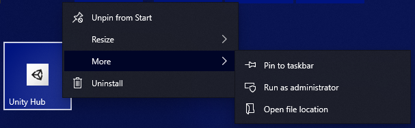
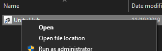
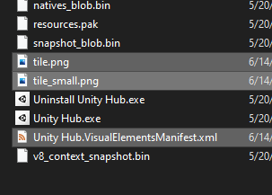
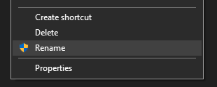
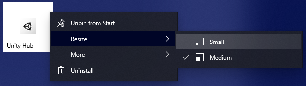
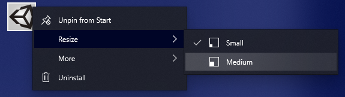

# How to install a tile

### Find the original shortcut file:

1. Right click on the tile you want to update.
1. Select **More**.
1. Select **Open file location**. File Explorer will now open the folder containing your shortcut file.

---

### Find the executable the shortcut points to:

1. Make sure you're in the File Explorer window that was just opened in the previous step.
1. Right click on the shortcut file that Windows highlighted for you.
1. Select **Open file location**.

---

### Deploy the tiles:

1. Find the tiles in this repository with a `VisualElementsManifest.xml` that matches the name of your target executable. For example `Unity Hub.exe` matches `Unity Hub.VisualElementsManifest.xml`
1. Copy the `tile.png`, `tile_small.png`, and `<executable>.VisualElementsManifest.xml` into the same folder as the executable.
1. I have made alternate images for some applications. If you prefer the alternate, then copy the alternate into the same folder instead of the original and delete the `alternate-` prefix from the filename.

---

### Force Windows to update the shortcut

1. Do the very first step way up above again. This will find the original shortcut file.
1. Rename this shortcut by right clicking on it and selecting **Rename**.
1. Just append a "1" to the title or something. Any new name is fine.
1. Rename the file again and remove the "1" you added so it has the original name.

---

### Force the tile images to be rebuilt

This resizing step is necessary to force Windows to update the displayed tile image.

1. Open the start menu and look at your shortcut. It's most likely been slightly modified now with a new background color, but this isn't the final form!
1. Right click on the tile and resize it to **Small**. Notice the smaller icon should be different.
1. Right click on the tile and resize it back to **Medium**.
1. Appreciate the new tile.

# License, sponsorship, officialness, support

Every logo in this library is owned by the respective trademark holder. I have received absolutely zero approval or support to create these tiles from any of the respective application owners, and the existence of a tile in this repository is in no way supported by the trademark owner.

If you are a trademark holder or application owner for one of these applications, and disapprove of the tiles I've created for your application, please submit an issue to this repository, or a pull request with updated tile images you'd prefer.

Anything that isn't owned or trademarked by someone else is licensed to you by me under the Unlicense.